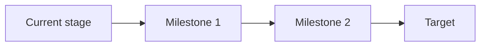

# Skill: Target Milestones

Use this skill after the goal and current stage are clear enough to draw a route.

## Purpose

Create a structural milestone route that helps the user see where they are, where they are going, and what path connects the two.

## When To Use

- The user needs a big-picture route.
- There are multiple milestones, dependencies, or uncertainties.
- The plan would feel arbitrary without a map.
- The user asks for a visual or intuitive explanation.

## Process

1. Summarize the current stage and destination.
2. Identify the minimum viable path, not every possible topic or task.
3. Split the journey into 3 to 6 milestones.
4. Mark dependencies: what must come before what.
5. Add risk points: likely confusion, motivation dips, time traps, safety issues, or validation risks.
6. Add observable checkpoints.
7. Produce a text route first.
8. If the user approves, hand off to `visual-rendering.md`.

## Output Format

```markdown
## Milestone Route

- Current stage:
- Destination:
- Main route:
- Milestones:
- Key dependencies:
- Risk points:
- Observable checkpoints:


```

## Visual Brief

Include this only after the text route is accepted or likely to be reviewed for image output:

```markdown
### Visual Brief For Milestone Route

- Canvas:
- Style:
- Layout:
- Nodes:
- Color logic:
- Must include:
- Must avoid:
```

## Quality Bar

A good milestone route feels like a path, not a syllabus dump or motivational poster. It shows the user what matters now, what comes later, and what evidence proves movement.
